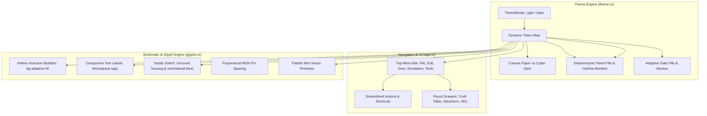

# Logic Lab — Visual & UX Polish Implementation Plan

## 1. Executive Summary & Objective

Based on the live application review and your design directives, this milestone refines **Logic Lab** from a functional prototype into an exquisite, professional-grade desktop CAD tool. It addresses all 7 identified visual discrepancies with `01_DESIGN.md`, introduces a **Light / Dark Mode Canvas Engine**, applies refined **Glassmorphism**, adds **Component Function Labels**, and restructures the crowded top bar into an intuitive **Menu Navigation System** with collapsible drawers.

Execution will proceed strictly **one phase at a time**, verifying each item with unit tests, `cargo clippy`, and visual review.

---

## 2. Core Architectural Enhancements

---

## 3. Work Breakdown by Phased Subtasks

### Phase A: Dynamic Light / Dark Mode & Glassmorphic Styling
*Goal: Provide instant toggling between "Warm Paper" Light Mode and "Cyber Dark" Dark Mode with refined glassmorphic panel translucency.*

1. **Theme Mode State (`theme.rs`)**:
   - Introduce `ThemeMode`:
     - **Light Mode ("Warm Paper")**:
       - `bg_canvas`: `#F4F1EC` (warm drafting paper)
       - `grid_line`: `#DDD8CE`
       - `gate_fill`: `#FAF8F5` (crisp paper white/cream fill)
       - `gate_stroke`: `#2A2630` / `#6E4C9E` (crisp 1.5px engineering strokes)
       - `text_on_canvas`: `#2A2630`
       - `bubble_fill`: `#F4F1EC` (matches canvas for authentic hollow look)
     - **Dark Mode ("Cyber Dark")**:
       - `bg_canvas`: `#0F0D12` (deep matte near-black)
       - `grid_line`: `#241F2B` (subtle circuit dots)
       - `gate_fill`: `#18141C` (semi-dark housing fill)
       - `gate_stroke`: `#6E4C9E` / `#B8A8C4`
       - `text_on_canvas`: `#EDEAF0`
       - `bubble_fill`: `#0F0D12`
   - Common Tokens (shared between modes):
     - `signal_high`: `#FF4FA3` (vibrant pink)
     - `signal_low`: `#4A4550` (subtle slate purple)
     - `accent_pink`: `#FF4FA3`
     - `accent_purple`: `#6E4C9E`
     - `accent_red`: `#E14B4B` (errors/deletions only)
2. **Glassmorphism Refinement**:
   - `Theme::glass_panel(mode)`: Background with 85% alpha, hairline 1px purple highlight border (`#6E4C9E`), and smooth corner rounding.
   - `Theme::glass_modal(mode)`: Raised background with 88% alpha, subtle glow/elevation shadow, and 8px corners.
3. **Application Integration**:
   - Store `theme_mode` in `LogicLabApp`.
   - Add toggle action (`Theme: Light / Dark`) in the top menu bar and hotkey (`F8` or `Ctrl+T`).

---

### Phase B: Top Toolbar De-cluttering & Menu Navigation
*Goal: Remove the 15-button horizontal clutter and replace it with clean, categorized flyout menus and quick-action tool drawers.*

1. **Top Menu Bar Hierarchy (`egui::menu::bar`)**:
   - **File**: `Save Circuit... (Ctrl+S)`, `Load Circuit... (Ctrl+O)`, `Clear Canvas`, `Export HDL`
   - **Edit**: `Undo (Ctrl+Z)`, `Redo (Ctrl+Y)`, `Duplicate (Ctrl+D)`, `Rotate (R)`, `Delete (Del)`, `Package Subcircuit`
   - **View**: `Theme: Light / Dark Mode`, `Toggle Grid`, `Snap to Grid`, `Reset Zoom (100%)`
   - **Simulation**: `Run / Pause Clock (2Hz)`, `Step Tick Clock`, `Clock Speed (1Hz, 2Hz, 5Hz, 10Hz)`
   - **Tools & Analysis**:
     - `Truth Table Generator` (collapsible drawer / modal)
     - `Universal Gates Lab` (NAND/NOR interactive tutor)
     - `Timing Waveform (Logic Analyzer)` (collapsible bottom drawer)
2. **Canvas Quick Indicators**:
   - Clean, compact status pills in the top right:
     - Clock status badge (`CLK: 2Hz` / `PAUSED`)
     - Zoom badge (`100%`)
     - Selection counter (`3 items selected`)
3. **Ergonomic Benefits**:
   - Reclaims vertical canvas real estate.
   - Restores the clean, hand-crafted desktop CAD aesthetic mandated by `01_DESIGN.md`.

---

### Phase C: Schematic Vector Glyphs & Component Labels
*Goal: Fix all glyph drawing discrepancies, add component name tags, and improve tactile switch mechanics.*

1. **Hollow Inversion Bubbles**:
   - In `glyphs.rs`: Update `draw_bubble` to take `canvas_fill: Color32`.
   - The interior is filled with the active canvas background (`#F4F1EC` in light mode, `#0F0D12` in dark mode) with a crisp 1.5px stroke, ensuring NOT, NAND, NOR, and XNOR have authentic hollow inversion bubbles.
2. **Component Function Labels & Designators**:
   - Render a small, tasteful monospace label (e.g., `AND`, `OR`, `NOT`, `XOR`, `NAND`, `NOR`, `CLA4`, `MUX4`, `DFF`) positioned subtly inside or directly above the component.
   - High legibility, non-intrusive, rendering in `text_on_canvas`.
3. **Tactile Mechanical Toggle Switch**:
   - Replace the flat box-and-dot with a realistic toggle switch:
     - Beveled switch plate housing.
     - Slotted lever track.
     - Angled mechanical toggle lever or slider clearly indicating mechanical position (UP/RIGHT for ON, DOWN/LEFT for OFF).
     - State indicator dot (`signal_high` pink when active).
4. **Proportional Input Pin Spacing**:
   - For 2-input gates (AND, OR, NAND, NOR, XOR, XNOR):
     - Space inputs across upper and lower thirds of the flat/curved back edge ($\pm 12\text{px}$ from center instead of $\pm 6\text{px}$).
     - Standardize stub lengths to 12px for predictable, crisp wire connections.
5. **Balanced Gate Fills (Eliminating Ink Blobs)**:
   - In Light Mode: Gate bodies use clean light fills (`#FAF8F5`) with dark technical outlines (`#2A2630`), reading like genuine schematic line-art instead of solid black silhouettes.
   - In Dark Mode: Deep housing fill (`#18141C`) with subtle purple outlines.

---

### Phase D: Palette Vector Glyphs & Typography
*Goal: Replace text chips with miniature vector glyph previews and eliminate all-caps shouting.*

1. **Palette Miniature Vector Glyphs**:
   - Update `palette.rs` to render a miniature vector preview (D-shape for AND, shield for OR, triangle with bubble for NOT, etc.) inside each palette button beside the label.
   - Removes generic `[AND]`, `[OR]` text tags and replaces them with true vector iconography.
2. **Typography Polish**:
   - Replace all-caps headers (`LOGIC GATES`, `INPUT / OUTPUT`, `DISPLAYS`, `ARITHMETIC`, `SEQUENTIAL`) with elegant Title Case (`Logic Gates`, `Input / Output`, `Displays`, `Arithmetic`, `Sequential`).
   - Title `Logic Lab` styled with subtle letter-spacing and refined medium weight.

---

## 4. Execution Sequence & Review Checkpoints

We will execute these phases sequentially, testing each step thoroughly before moving to the next:

1. **Step 1**: Implement Phase A (Light / Dark Mode engine & Glassmorphic frame tokens).
2. **Step 2**: Implement Phase B (Menu Navigation bar & top bar de-cluttering).
3. **Step 3**: Implement Phase C (Hollow bubbles, component labels, tactile switches, proportional pins, balanced gate fills).
4. **Step 4**: Implement Phase D (Palette mini vector glyphs & typography polish).
5. **Step 5**: Run full workspace test suite (`cargo test`), `cargo clippy`, and `cargo fmt`.
6. **Step 6**: Commit and push changes to GitHub.
